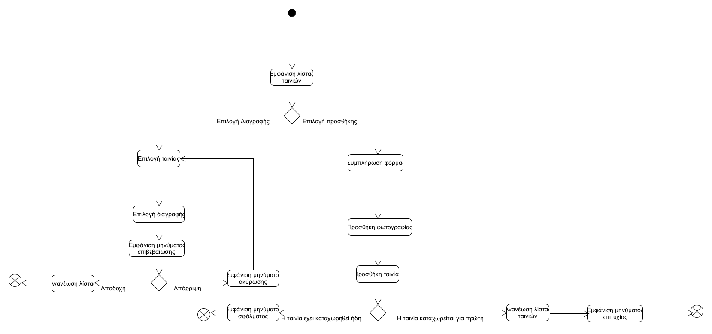
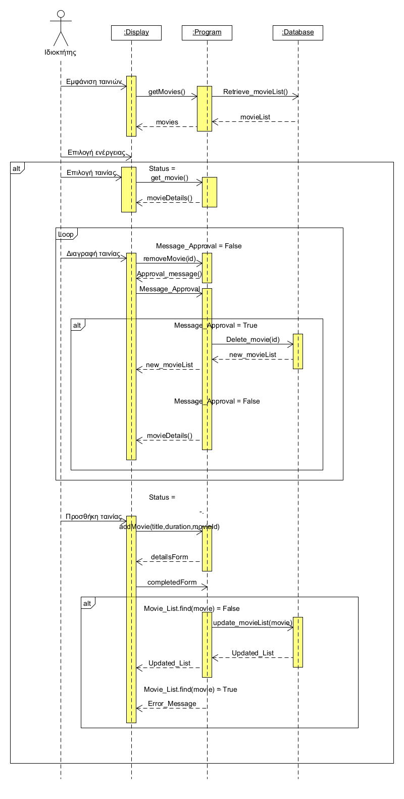

# ΠΧ Διαχείριση ταινιών

**Πρωτεύον actor:** Ιδιοκτήτης

**Ενδιαφερόμενοι:** Ιδιοκτήτης: Θέλει να εκτελέι ενέργειες στην βάση δεδομένων της εφαρμογής για την σωστή ενημέρωση των πελατών.  
Πελάτης:θέλει να γνωρίζει τα στοιχεία κάθε ταινίας που προβάλλεται.

**Προϋποθέσεις:** Ο ιδιοκτήτης έχει πραγματοποιήσει εγγραφή ιδιοκτήτη και ταυτοποιήση χρήστη.

## Βασική Ροή
#
### A) Προσθήκη ταινίας 
1. Το Σύστημα εμφανίζει την λίστα των ταινιών που προβάλει το σινεμά.
2. Ο ιδιοκτήτης επιλέγει να καταχωρήσει μια κανούργια ταινία.
3. Το Σύστημα ζητάει απο τον ιδιοκτήτη να συμπληρώσει την φόρμα με τα στοιχεία που χρειάζεται.
4. Ο ιδιοκτήτης καταχωρεί την καινούργια ταινία.
5. Το Σύστημα ανανεώνει την λίστα των ταινιών που προβάλλονται.
6. Το σύστημα επιστρέφει στην αρχική οθόνη.

**Εναλλακτικές Ροές**

*4α. Η τανία υπάρχει ήδη στην λίστα.*  
1. Το σύστημα εμφανίζει μύνημα σφάλματος.
2. Η ΠΧ τερματίζει.

### Β) Διαγραφή ταινίας
1. Το Σύστημα εμφανίζει την λίστα των ταινιών που προβάλει το σινεμά.
2. Ο ιδιοκτήτης επιλέγει μια ταινία.
3. Το Σύστημα του εμφανίζει τα στοιχεία της ταινίας.
4. Ο ιδιοκτήτης επιλέγει να διαγράψει την ταινία.
5. Το Σύστημα του εμφανίζει μήνυμα επιβεβαίωσης.
6. ο ιδιοκτήτης αποδέχετε το μήνυμα. 
7. Το Σύστημα διαγράφει την ταινία. 
8. Το Σύστημα ανανεώνει την λίστα των ταινιών που προβάλονται.
9. Το σύστημα επιστρέφει στην αρχική οθόνη.

**Εναλλακτικές Ροές**
*6α. Ο ιδιοκτήτης δεν αποδέχεται το μήνυμα*  
1. Η ΠΧ συνεχίζει στο βήμα 3 της βασικής ροής.

## Activity Diagram

## Sequence Diagram

