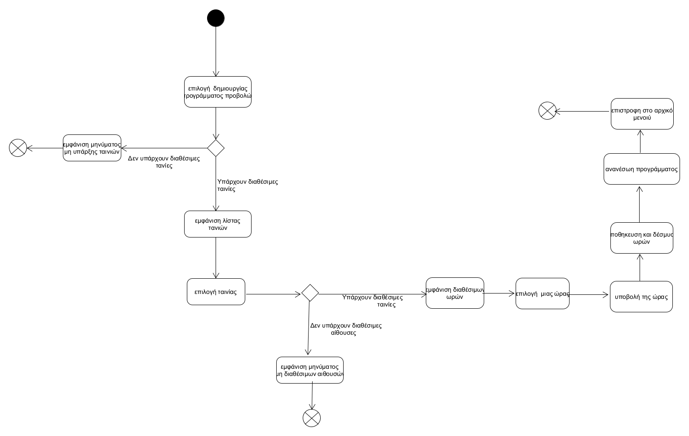
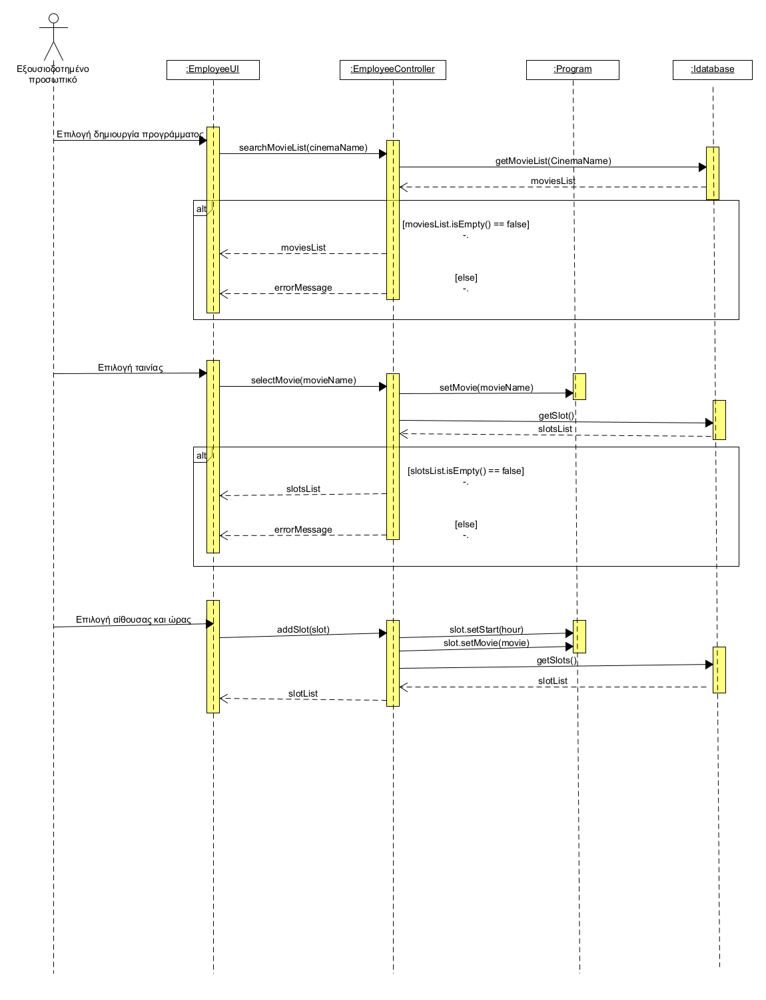

# ΠΧ Διαχείρηση προγράμματος ταινιών

**Πρωτεύον actor:** Εξουσιοδοτημένο προσωπικό

**Ενδιαφερόμενοι:**

 Πελάτης: Θέλει να υπάρχει έτοιμο το πρόγραμμα ταινιών ώστε να μπορέσει να διαλέξει σε ποιά προβολή θέλει να κάνει κράτηση.

 Εξουσιοδοτημένο προσωπικό: Θέλει να δημιουργήσει ένα πρόγραμμα ταινιών το οποίο θα υποστηρίζει ταυτόχρονες προβολές ταινιών στις διάφορες αίθουσες του κινηματογράφου.

**Προϋποθέσεις:** Το εξουσιοδοτημένο προσωπικό έχει ανατεθεί σε κάποιον κινηματογράφο απο τον ιδιοκτήτη και έχει κάνει sign in. Όλες οι ταινίες έχουν διάρκεια 2 ώρες. Κάθε κινηματογράφος ξεκινάει τις προβολές από τις 3 το μεσημέρι εώς τις 12 το βράδυ.

## Βασική Ροή
#

1. Το εξουσιοδοτημένο προσωπικό επιλέγει την δημιουργία προγράμματος προβολών κινηματογράφου.
2. Το σύστημα εμφανίζει  την λίστα των διαθέσιμων ταινιών για προβολή.
3. Το εξουσιοδοτημένο προσωπικό επιλέγει την ταινία που θέλει να προγραμματίσει για προβολή.
4. Το σύστημα εμφανίζει τις διαθέσιμες αίθουσες για επιλογή(όπου διαθέσιμη αίθουσα έχει κενό 2ώρο για προβολή).
5. Το εξουσιοδοτημένο προσωπικό επιλέγει την αίθουσα που θέλει να γίνει η προβολή της ταινίας.
6. Το σύστημα εμφανίζει τις διαθέσιμες ώρες που μπορεί να γίνει προβολή της ταινίας στην συγκεκριμένη αίθουσα.
7. Το εξουσιοδοτημένο προσωπικό επιλέγει απο τις διαθέσιμες ώρες μία απο αυτές ώστε να προγραμματιστεί προβολή της ταινίας εκείνη την ώρα (αν δεν υπαρχουν διαθεσιμες ωρες σημαίνει οτι η αίθουσα δεν είναι διαθέσιμη).
8. Το εξουσιοδοτημένο προσωπικό πατάει υποβολή προβολής.
9. Το σύστημα αποθηκεύει την προβολή και δεσμεύει τις ώρες.
10. Το σύστημα ανανεώνει το πρόγραμμα προβολών και επιστρέφει στην αρχική οθόνη.

**Εναλλακτικές ροές**

2α. Δεν υπάρχουν ταινίες για προβολή (ο ιδιοκτήτης δεν έχει προσθέσει ταινίες στον συγκεκριμένο κινηματογράφο που είναι "υπεύθυνο" το εξουσιοδοτημένο προσωπικό).
1. Το σύστημα εμφανίζει μήνυμα ότι δεν υπάρχουν ταινίες για προβολή.
2. Η ΠΧ τερματίζει.

4α. Δεν υπάρχουν διαθέσιμες αίθουσες.
1. Το σύστημα εμφανίζει μήνυμα οτι δεν υπάρχουν διαθέσιμες αίθουσες.
2. Η ΠΧ τερματίζει.

## Activity Diagram  

## Sequence Diagram

