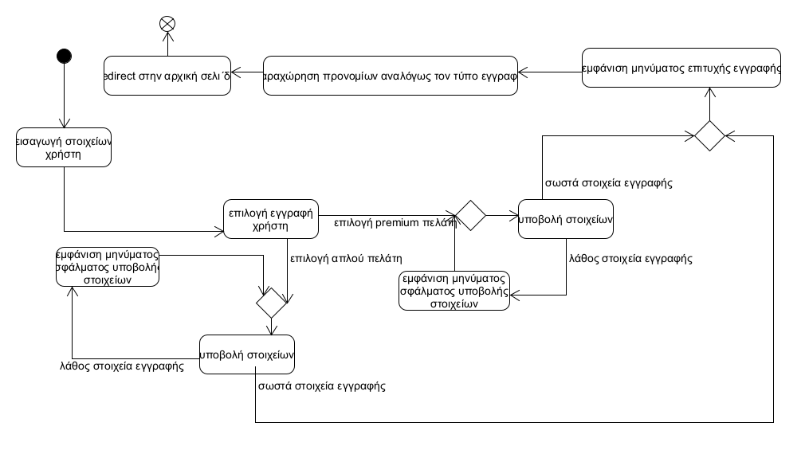
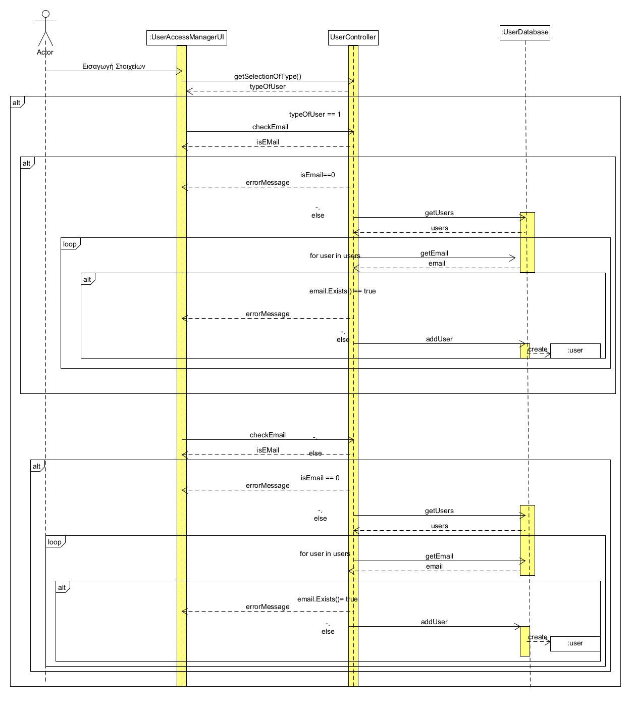

# ΠΧ Εγγραφή Χρήστη

**Πρωτεύον actor:** Πελάτης

**Ενδιαφερόμενοι:**

Πελάτης: Θέλει να αποκτήσει πρόσβαση στις δυνατότητες τις εφαρμογής.

Ιδιοκτήτης: Θέλει όλο και περισσότερους πελάτες να χρησιμοποιήσουν την εφαρμογή.

**Προϋποθέσεις:** Ο πελάτης έχει λογαριασμό email.

## Βασική Ροή
#
1. Ο πελάτης πατάει το κουμπί εγγραγής χρήστη.
2. Το σύστημα εμφανίζει κατάλληλη φόρμα για την εισαγωγή στοιχείων.
3. Ο πελάτης εισάγει τα στοιχεία του (όνομα, επίθετο, email, κωδικό).
4. Το σύστημα εμφανίζει 2 κουμπιά.Ένα για εγγραφή απλού χρήστη, ένα για εγγραφή premium χρήστη.
5. Ο πελάτης πατάει υποβολή στοιχείων εγγραφής. 
6. Το σύστημα εμφανίζει μήνυμα επιτυχής εγγραφής.
7. To σύστημα δίνει access σε προνόμια χρήστη ανάλογα την εγγραφή.
8. Το σύστημα καταχωρεί τα δεδομένα.
9. Το σύστημα κάνει redirect τον χρήστη στην αρχική σελίδα της εφαρμογής.

**Εναλλακτικές ροές**

5α. Ο πελάτης επιλέγει το κουμπί εγγραφής premium user
1. Το σύστημα εμφανίζει τα προνόμια premium users
2. Το σύστημα εμφανίζει κατάλληλη φόρμα για την εισαγωγή στοιχείων πιστωτικής κάρτας.
3. Ο πελάτης συμπληρώνει τα στοιχεία της κάρτας.  
    3α. Ο πελάτης έδωση μη έγκυρα στοιχεία.
    1. Το σύστημα εμφανίζει μήνυμα λάθους στη εισαγωγλη στοιχείων.
    2. Η ΠΧ επιστρέφει στο βήμα 2 της εναλλακτικής ροής.
4. Η ΠΧ επιστρέφει στο βήμα 5 της βασικής ροής.

6α. Ο πελάτης εδώσε μη εγκύρα στοιχεία
1. Το σύστημα εμφανίζει μήνυμα ότι εγίνε λάθος στην εισαγωγή των στοιχείων.
2. Η ΠΧ επιστρέφει στο βήμα 2 της βασικής ροής.

## Activity Diagram  

## Sequence Diagram  

