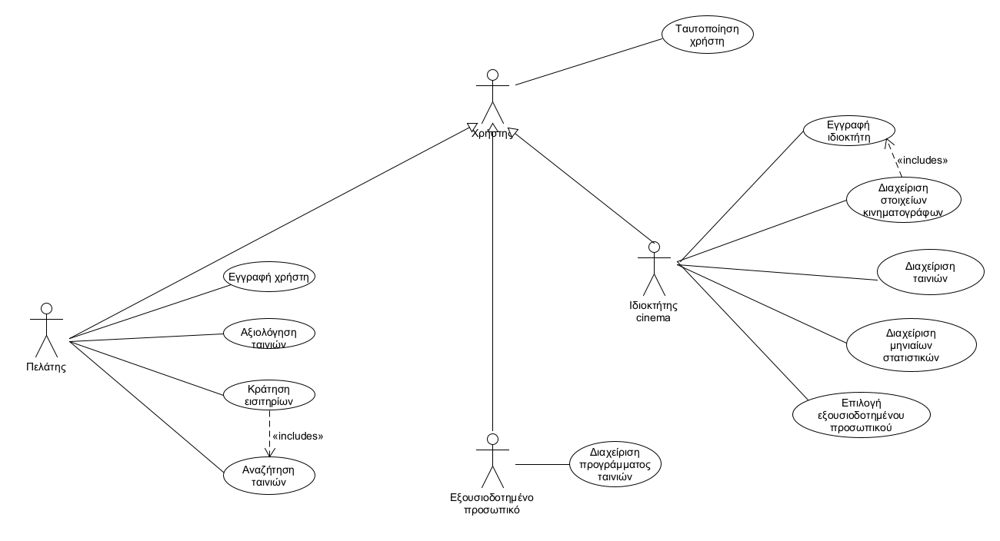
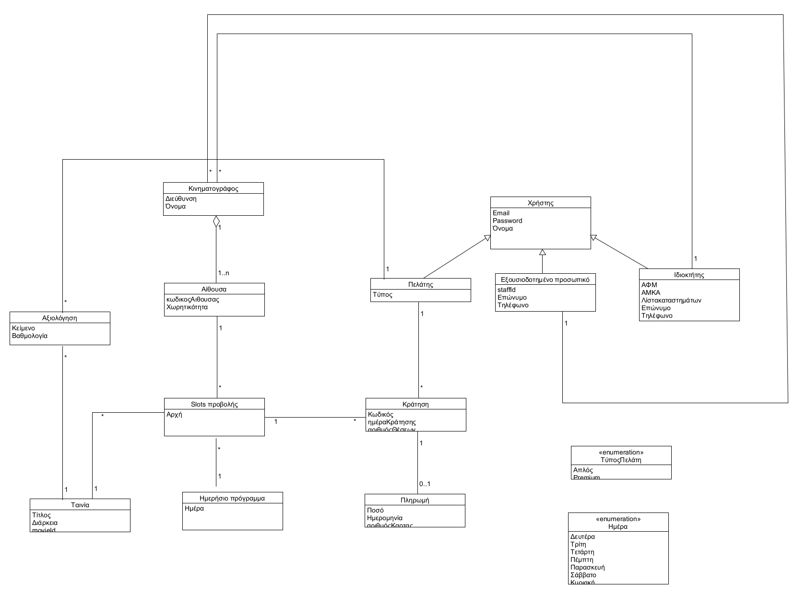

# Απαιτήσεις Συστήματος
Η εφαρμογή μας θα έχει τις παρακάτω απαιτήσεις:

* Έλεγχος στοιχείων χρήστη κατά την είσοδο
* Αποθήκευση στοιχείωνv χρήστη κατά την εγγραφή 
* Υπολογισμός  κόστους για κάθε κράτηση
* Εμφανιση λεπτομερειών κράτησης 
* Έλεγχος διαθεσιμότητας εισιτηρίων με βάση ορισμένων κριτηρίων(τοποθεσία,ώρα,ταινία)
* Στην περίπτωση που υπάρχουν διαθέσιμα εισιτήρια η εφαρμογή θα εμφανίζει τις ημερομηνίες, τις αιθουσες και τον αριθμό διαθέσιμων εισιτηρίων καθώς και την κάτοψη της αίθουσας
* δυνατότητα βαθμολόγησης ταινιών
* δυνατότητα για ερωτήσεις/feedback προς τον κινηματογράφο
* Να δίνεται δυνατότητα στον admin/ιδιοκτήτη να διαχειρίζεται τα στοιχεία των κινηματογράφων
* Διαχωρισμός premium με απλό user
* Δυνατότητα κράτησης εισιτηρίων
* Προτεραιότητα στις κρατήσεις εισιτηρίων απο τους premium users
* Αποκλειστικές διαθέσιμες θέσεις για τους premium users
* Ανεξάρτητος χώρος από την βαθμολογία ταινιών του απλού χρήστη που θα μπορεί να βαθμολογεί ταινίες και να γράφει κριτικές για τον premium user
* Καταγραφή και αποθήκευση μηνιαίου αριθμού των συνολικών 1)Εσόδων 2) πωλημένων Εισιτηρίων 3)Κρατήσεων 4)Παραπόνων 5)ταινιών που προβλήθηκαν
* Πρόσβαση στα παραπάνω δεδομένα μόνο στον ιδιοκτήτη(admin)
* Να δίνεται η δυνατότητα στον admin/ιδιοκτήτη να παραχωρεί δυνατότητες σε εξουσιοδοτημένο προσωπικό
* Το εξουσιοδοτημένο προσωπικό θα καταθέτει το πρόγραμμα ταινιών 

## USE CASE DIAGRAM  

# Σύντομη περιγραφή περιπτώσεων χρήσης
* [ΠΧ:Εγγραφή χρήστη](docs/markdown/sign_up.md)
* [ΠΧ:Ταυτοποίηση χρήστη](docs/markdown/sign_in.md)
* [ΠΧ:Εγγραφή ιδιοκτήτη](docs/markdown/owner_sign_up.md)
* [ΠΧ:Διαχείρηση στοιχείων κινηματογράφων:](docs/markdown/cinema_data_management.md)
* [ΠΧ:Διαχείριση ταινιών:](docs/markdown/movie_management.md)
* [ΠΧ:Διαχείριση μηνιαίων στατιστικών:](docs/markdown/cinema_statistics_management.md)
* [ΠΧ:Επιλογή εξουσιοδοτημένου προσωπικού:](docs/markdown/selection_of_qualified_staff.md)
* [ΠΧ:Διαχείριση προγράμματος ταινιών:](docs/markdown/movie_program_management.md) 
* [ΠΧ:Αξιολόγηση ταινιών:](docs/markdown/movie_rating.md)
* [ΠΧ:Κράτηση εισιτηρίων:](docs/markdown/ticket_reservation.md)
* [ΠΧ:Αναζήτηση ταινιών:](docs/markdown/movie_search.md) 

## Μοντέλο Πεδίου  

