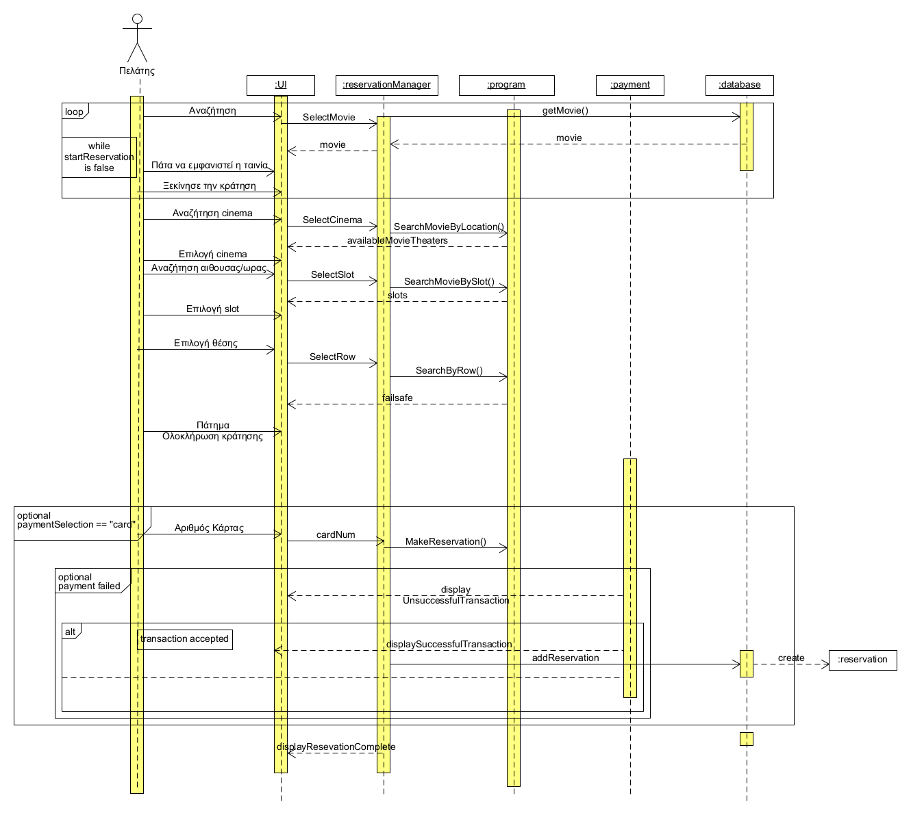

# **ΠΧ. Κράτηση εισιτηρίων**
**Πρωτεύον Actor:** Πελάτης 

**Ενδιαφερόμενοι**  
Πελάτης: Θέλει να κρατήσει εισιτήρια ώστε να παρακολουθήσει μία ταινιά   

**Προϋποθέσεις:** Ο Πελάτης έχει κάνει εγγραφή και έχει ταυτοποιηθεί για την πρόσβαση του στο σύστημα  

<u>**Βασική Ροή**</u>  

1. Ο Πελάτης αναζητά την ταινία που θέλει να παρακολουθήσει  
&emsp;&emsp;(Συμπερίληψη: Αναζήτηση ταινιών).  
2. Το σύστημα εμφανίζει την ταινία που επέλεξε ο πελάτης και τα στοιχεία της.  
3. Ο Πελάτης επιλέγει να προχωρήσει σε κράτηση εισιτηρίων.  
4. Ο Πελάτης επιλέγει το σινεμά το οποίο επιθυμεί.  
5. Το σύστημα εμφανίζει τις αίθουσες του cinema στις οποίες προβάλλεται η ταινία.  
6. Ο πελάτης επιλέγει αίθουσα.  
7. Το σύστημα εμφανίζει την κάτοψη της αίθουσας μαζί με τις διαθέσιμες θέσεις.  
8. Ο πελάτης επιλέγει  θέσεις.  
9. Ο πελάτης κάνει κράτηση και πατάει πληρωμή.  
10. Το σύστημα εμφανίζει τους τρόπους πληρωμής (πληρωμή σε ταμείο ή κάρτα).  
11. Ο Πελάτης επιλέγει τρόπο πληρωμής με κάρτα.  
12. Το σύστημα ζητάει τα στοιχεία της κάρτας (Αριθμός κάρτας, ημερομηνία λήξης,CSV).  
13. Ο πελάτη βάζει τα στοιχεία.  
14. Το σύστημα αποδέχεται την συναλλαγή.
15. Το σύστημα δεσμεύει τις θέσεις.    
16. Το σύστημα ενημερώνει το πελάτη ότι η κράτηση πραγματοποιήθηκε.  
17. Το σύστημα επιστρέφει στην αρχική οθόνη.

<u>**Εναλλακτικές Ροές**</u> 
3a. Ο Πελάτης επιλέγει να προχωρήσει σε κράτηση εισιτηρίων.  
1. Επιστροφή στην βασική ροή 1.
 
7a. Δεν υπάρχουν διαθέσιμες θέσεις  
1. Το σύστημα ενημερώνει τον πελάτη με κατάλληλο μήνυμα ότι δεν υπάρχουν διαθέσιμες θέσεις.
2. Το σύστημα δίνει την δυνατότητα στο πελάτη να γυρίσει στην βασική ροή νούμερο 5 ώστε να επιλέξει κάποια άλλη διαθέσιμη αίθουσα αν υπάρχει.  

10a. Ο πελάτης επιλέγει τρόπο πληρωμής στο ταμείο  
1. Το σύστημα δίνει την δυνατότητα στο πελάτη να γυρίσει στην βασική ροή νούμερο 15. 

14a. Τα στοιχεία δεν είναι έγκυρα  
1. Το σύστημα ενημερώνει τον πελάτη με κατάλληλο μήνυμα. 
2. Το σύστημα δίνει την δυνατότητα στο πελάτη να γυρίσει στην βασική ροη 12.  

## Activity Diagram

## Sequence Diagram

